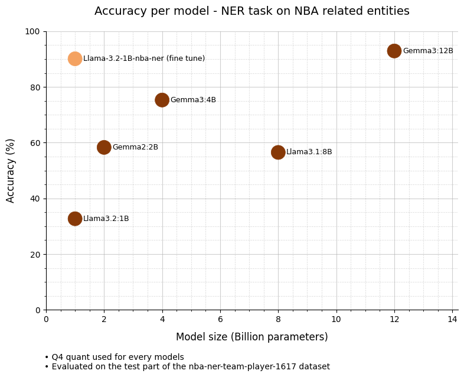

# NBA Named Entity Recognition (NER) with Synthetic Data

**Fine-tuning a lightweight LLM for extracting NBA player and team names from text.**

---

## 📌 Overview

This repository provides tools for two main tasks:
1. **Generating a synthetic dataset** of NBA-related sentences, annotated for Named Entity Recognition (NER) (player names and team names).
2. **Fine-tuning a lightweight LLM** on this dataset.

The approach enabled training a **1B-parameter model** that matches the performance of state-of-the-art models **12x larger**, while maintaining fast inference times.

The fine tuned model available on Huggingface: [Llama-3.2-1B-nba-ner-GGUF-Q4_K_M](https://huggingface.co/pdesj/Llama-3.2-1B-nba-ner-GGUF-Q4_K_M)

---

## 🛠️ Setup

### Prerequisites
- [uv](https://docs.astral.sh/uv/) (for dependency management and execution)

### Environment Variables
Configure the project via environment variables. See [`src/settings.py`](src/settings.py) for available options.

---

## 🚀 Quick Start

1. **Install dependencies:**
   ```bash
   uv sync
   ```

2. **Generate synthetic sentences:**
   ```bash
   uv run python -m src.generate_synthetic_sentences
   ```

3. **Annotate sentences:**
   ```bash
   uv run python -m src.annotate_sentences
   ```

4. **Evaluate sentence quality:**
   ```bash
   uv run python -m src.evaluate_sentences
   ```

5. **(Optional) Identify errors for manual dataset cleaning:**
   ```bash
   uv run python -m src.identify_errors
   ```

6. **Split and preprocess the dataset:**
   ```bash
   uv run python -m src.split_and_preprocess_dataset
   ```

7. **Train the model:**
   ```bash
   uv run python -m src.train
   ```

8. **Run the NER demo app:**
   ```bash
   uv run python -m streamlit run src/app_ner.py
   ```

---

## 🔍 Key Features

- **Synthetic Data Generation:** Automatically create diverse training samples.
- **Efficient Fine-Tuning:** Optimized for lightweight models.
- **Interactive Demo:** Visualize model predictions with a Streamlit app.

---

## 📊 Results

The fine-tuned model (`Llama-3.2-1B-nba-ner`) achieves near-parity with models **12x larger** in terms of accuracy, while offering **faster inference**:





**Model Comparison**


| Model                | Size (B) | Accuracy (%) | Mean Processing Duration* (s) |
|----------------------|----------|--------------|-------------------------------|
| Llama-3.2-nba-ner    | 1        | 90.1         | 0.38                          |
| Llama3.2             | 1        | 32.7         | 0.79                          |
| Gemma2               | 2        | 58.3         | 1.43                          |
| Gemma3               | 4        | 75.3         | 0.69                          |
| Llama3.1             | 8        | 56.5         | 1.16                          |
| Gemma3               | 12       | 92.9         | 2.73                          |

\* *Benchmarked on an RTX 3060 Laptop GPU.*

---

## 📝 Roadmap & Improvements

<details>
<summary><strong>Dataset Enhancements</strong></summary>

- Increase diversity by adding more entities per sample.
- Incorporate real-world NBA articles for robustness.
- Expand to multilingual support.

</details>

<details>
<summary><strong>Training Optimization</strong></summary>

- Experiment with hyperparameters (epochs, learning rate, loss functions).
- Address underfitting/overfitting through regularization and validation.

</details>

<details>
<summary><strong>Model Exploration</strong></summary>

- Benchmark additional models and sizes.
- Investigate quantization for further efficiency gains.

</details>

---
